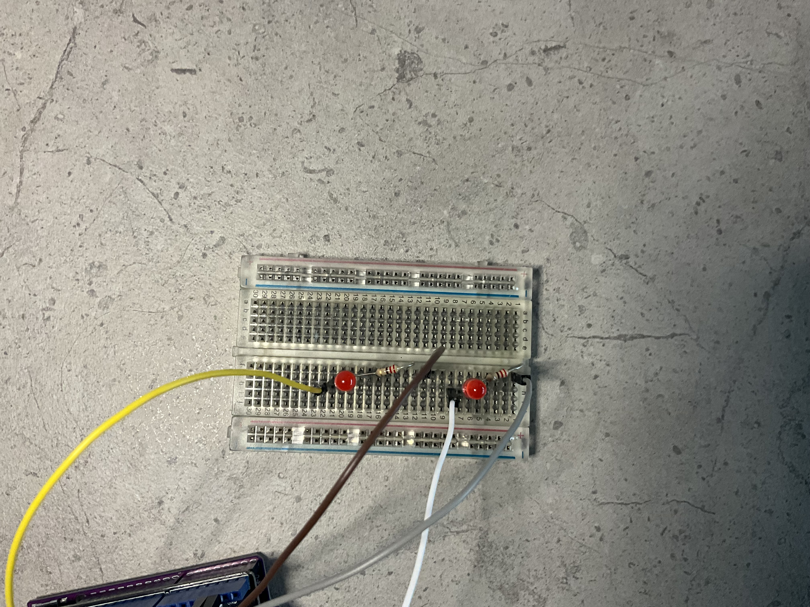
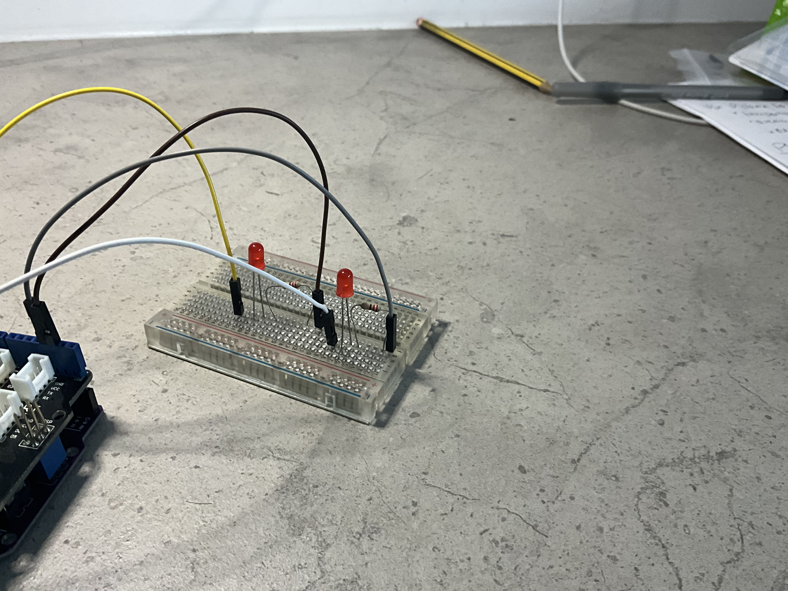

# PC_Temperature_Monitor-
# PROJECT OVERVIEW: This project is an Arduino-based temperature monitoring system designed to explore the fundamentals of embedded systems, sensor integration, and hardware-software communication. The system uses a Grove temperature sensor connected to an Arduino to collect temperature data in real time. LED indicators are used to visually represent temperature thresholds, while serial communication allows the Arduino to transmit sensor data to a connected computer for monitoring and future visualisation in python. The project was developed as part of my self-directed summer engineering portfolio to strengthen my understanding of electronics, embedded programming, circuit design, and mechatronics system integration.
# OBJECTIVES: 
# Develop foundational understanding of embedded systems 
# Learn how analog temperature sensors interface with microcontrollers
# understand breadboard circuit design and current flow 
# Implement LED-based temperature indication logic
# Explore serial communication between Arduino and a computer 
# Build confidence in independent electronics prototyping 
# Document the engineering process using GitHub
# FEATURES : 
# Real-time temperature sensing 
# LED-based temperature status indication
# Serial monitor temperature output 
# Breadoard-based prototype circuit
# Expandable architecture for future python dashboard integration 
# CIRCUIT DESIGN:
# The hardware system was designed using an Arduino microcontroller,  a Grove Base Shield, a Grove analog temperature sensor, two LEDs, resistors, and a breadboard-based prototyping setup. The Grove temperature sensor was connected to the A0 analog input port on the Grove Base Shield. This was necessary because the sensor outputs a continuously varying analog voltage proportional to temperature. The Ardunino's built-in Analog-to-Digital Converter (ADC) converts this analog signal into digital numerical values that can be processed in software. Two Leds were integrated into the cicuit as visual temperature indicators. The positive leg (anode) of each LED was connected to Arduino digital output pins 2 and 3 through current limiting resistors. The negative leg (cathode) of each LED was connected to ground (GND). Resistors were ued to limit current flow through the LEDs and protect the components from excessive current draw. The LEDs and resistors were connected in series on the breadboard to create complete electrical paths between the Arduino output pins and ground. Although multiple ground pins are available on the Arduino, all GND pins are internally conneceted to the same electrical refernce point. This allowed multiple components to share common ground connections while keeping the wiring layout organised and manageable.
# SYSTEM ARCHITECTURE:
# The system operates by continuously reading temperature data from the analog Grove temperature sensor. The sensor outputs a voltage that varies according to environmental temperature conditions. The Arduino reads this analog signal through the A0 input pin and converts it into digital values using its onboard ADC. Embedded logic within the Arduino program then determines the current temperature state and activates LED indicators accordingly. Temperature data is also transmitted from the Arduino to a connected computer using serial communication over USB. This enables future expansion into Python-based monitoring dashboards, live plotting, and data logging systems.

# EMBEDDED SYSTEM ARCHITECTURE:
# Temperature Sensor
#         ↓
# Analog Signal
#         ↓
# Arduino A0 Input
#         ↓
# ADC Conversion
#         ↓
# Embedded Logic
#         ↓
# LED Status Indicators
#         ↓
# Serial Communication
#         ↓
# Computer Monitoring

# CIRCUIT PROTOTYPE: 

