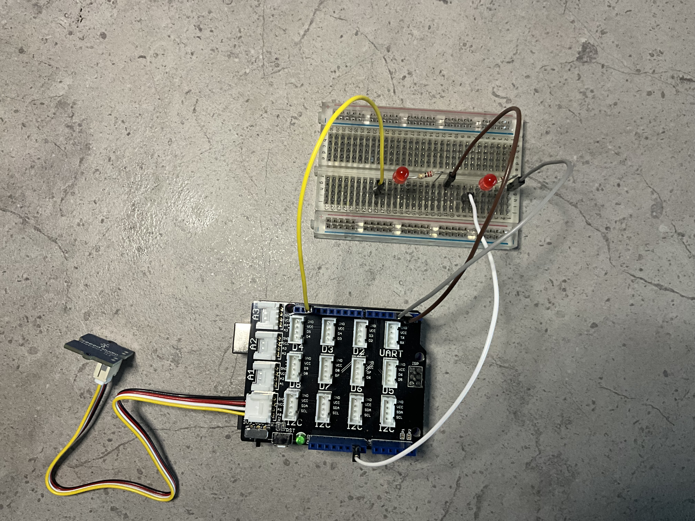
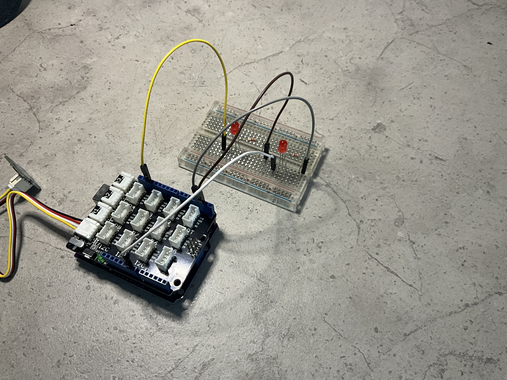
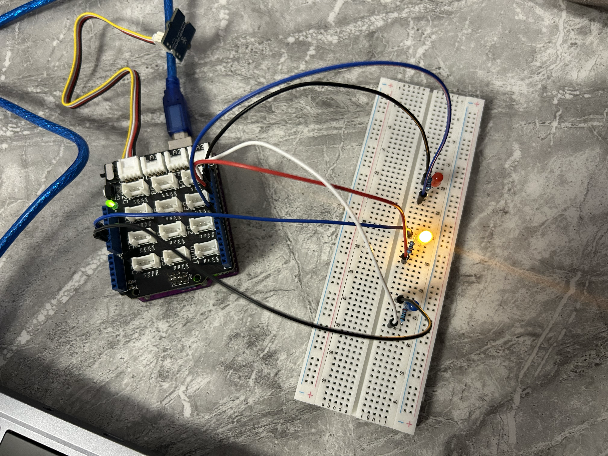

# PC_Temperature_Monitor-
Developed a PC temperature monitoring system using an Arduino and a thermistor temperature sensor, with Python-based data processing and LED indicators to monitor and communicate temperature states.

# PROJECT OVERVIEW: 
This project is an Arduino-based temperature monitoring and visualisation system developed to explore the fundamentals of embedded systems, sensor integration, analogue signal processing, embedded programming, and hardware-software communication.
The system uses a Grove Temperature Sensor connected to an Arduino to measure ambient temperature in real time. The analogue output from the sensor is read by the Arduino and processed to determine the temperature in degree Celsius. This involves converting the analog-to-digital converter (ADC) reading into a voltage, using the voltage to determine the thermistor resistance through the potential divider relationship, and then applying the thermistor Beta equation to calculate temperature. 
Three LEDs provide real-time visual feedback of the measured temperature, representing cold, warm, and hot operating states. State-based logic and hysteresis were implemented to improve the robustness of the system and reduce unwanted switching around temperature thresholds. 
Temperature data is also transmitted to a connected computer using serial communication, providing the foundation for future Python-based visualisation and data logging. 
The project was developed as part of my self-directed summer engineering portfolio to strengthen my practical understanding of electronics, embedded programming, circuit design, mathematical modelling, debugging, testing, and mechatronic system integration.

# OBJECTIVES: 
- Develop foundational understanding of embedded systems.
- Learn how analog temperature sensors interface with microcontrollers.
- Understand breadboard circuit design and current flow.
- Implement LED-based temperature indication logic
- Explore serial communication between Arduino and a computer 
- Build confidence in independent electronics prototyping 
- Document the engineering process using GitHub
# FEATURES : 
- Real-time temperature sensing 
- LED-based temperature status indication
- Serial monitor temperature output 
- Breadboard-based prototype circuit
- Expandable architecture for future python dashboard integration 

# HARDWARE & CIRCUIT DESIGN:
The system was developed using a KONO 38 (Arduino Uno-compatible board), Grove Bae Shield, Grove Temperature Sensor, three LEDs, three resistors, a breadboard and jump wires.
The Grove Temperature Sensor is connected t the analogue A0 interface of the Grove Base Shield. The sensor provides an analogue voltage that varies with the resistance of the thermistor as the ambient temperature changes.
The three LEDs are connected to separate digital output pins on the Arduino, with each LED representing one of the three states. Each LED is connected in series with a resistor to prevent excessive current from flowing through the LED. The LED cathodes are connected to the ground, while the anodes are connected through the resistors to their respective Arduino digital output pins. 
The circuit was initially developed using a simpler LED configuration to verify the Arduino's digital output, LED polarity, resistor configuration, and basic breadboard connectivity. Once the initial functionality had been confirmed, the circuit was expanded using the components available in the Arduino starter kit I obtained, to create the current three-state temperature monitoring system.
# INITIAL PROTOTYPE

This initial prototype was created due to my limited access to resources at the time, however was improved and made more efficient when I got an Arduino starter kit.
# FINAL PROTOTYPE:

The final prototype incorporates the Grove Temperature Sensor and three LED indicators representing the cold, warm, and hot operating states.
A formal electrical schematic of the final circuit will be developed in KiCad as a future stage of the project

# SYSTEM ARCHITECTURE:
The system operates as a continuous sensing, processing, and feedback loop. The Grove Temperature Sensor detects the ambient temperature and produces an analogue voltage corresponding to the thermistor's electrical characteristics.
This analogue signal is received by the Arduino through the input and converted into a digital value using the Arduino's analogue-to-digital converter (ADC).
The ADC reading is then processed within the embedded program to determine the sensor voltage and thermistor resistance. The calculated resistance is used with the known reference values of the thermistor to determine the temperature using the Beta equation. 
The resulting temperature is converted into degrees Celsius and passed to the embedded state-control logic.
The Arduino then determines whether the system should be operating in the cold, warm, or hot state and activities the corresponding LED. The calculated temperature is also transmitted through serial communication to a connected computer.
The overall system can therefore be represented as:

- Grove Temperature Sensor
-       ↓
- Analogue Signal
-       ↓
- Arduino A0
-       ↓
- ADC Reading
-       ↓
- Voltage Calculation
-       ↓
- Resistance Calculation
-       ↓
- Beta Equation
-       ↓
- Temperature (°C)
-       ↓
- State Logic
-     ↙   ↓   ↘
- Blue  Yellow  Red
- LED    LED    LED
-       ↓
- Serial Communication
-       ↓
- Computer

# TEMPERATURE MEASUREMENT & MATHEMATICAL MODEL
The Grove Temperature Sensor uses a thermistor to measure ambient temperature. A thermistor is a temperature-dependent resistor, meaning that its electrical resistance changes as the temperature changes. For this sensor, the resistance increases as the temperature decreases.
The Arduino does not directly receive a temperature value from the sensor. Instead, it receives an analogue voltage through the A0 input. The Arduino's ADC converts this analogue voltage into a numerical ADC reading.
The ADC reading is first converted into the corresponding sensor output voltage. This voltage is then used with the potential-divider relationship to determine the resistance of the thermistor.
Once the thermistor resistance has been calculated, the Beta equation can be used to determine the absolute temperature:
1/T = 1/T₀ + (1/B) ln(R/R₀)
where T represents the thermistor temperature in Kelvin, T₀ is the reference temperature, R is the calculated thermistor resistance, R₀ is the thermistor resistance at the reference temperature, and B is the Beta constant for the thermistor.
The calculated temperature is initially obtained in Kelvin and is then converted into degrees Celsius before being displayed through the Serial Monitor and used by the temperature-state logic.
The measurement process can therefore be summarised as:
- ADC Reading
-       ↓
-  Sensor Voltage
-       ↓
-  Thermistor Resistance
-       ↓
-  Beta Equation
-       ↓
-  Temperature in Kelvin
-       ↓
- Temperature in °C
- 
This process allowed the project to explore the relationship between a physical environmental quantity, an electrical property, an analogue voltage, and a digital measurement.

# EMBEDDED SOFTWARE & STATE LOGIC 
The Arduino program continuously reads the temperature sensor and processes the measurement before determining the appropriate temperature state.
The program uses analogRead() to obtain the ADC reading from A0. The reading is then used in the voltage, resistance, and temperature calculations.
Serial.begin() establishes serial communication with the connected computer, while Serial.println() is used to transmit the calculated temperature for monitoring through the Serial Monitor.
The LED control is implemented using digital outputs and digitalWrite(). The system uses three states: cold, warm, and hot. Each state corresponds to a different LED.
Rather than treating every temperature reading as an entirely independent decision, the program stores the current state using a state variable. This allows the system to consider both the current temperature and the state that the system was previously operating in.
The basic operating logic is:
- Read temperature
-       ↓
- Determine current state
-       ↓
- Check whether transition threshold has been reached
-       ↓
- Update state if required
-       ↓
- Activate corresponding LED
-       ↓
- Transmit temperature through Serial
-       ↓
-    Repeat
  
The system therefore behaves as a simple embedded state machine rather than simply switching LEDs based on one set of temperature conditions.

# HYSTERESIS & SYSTEM IMPROVEMENT:
During the initial testing of the temperature-state system, the LEDs could rapidly switch between states when the measured temperature was close to a threshold.
This occurred because the temperature sensor continuously produces changing measurements, meaning that small fluctuations around a threshold could cause the system to repeatedly change between two states.
To improve the robustness of the system, hysteresis was introduced.
Instead of using the same temperature boundary for entering and leaving a state, separate thresholds were implemented. This creates a deliberate temperature gap between state transitions and prevents small fluctuations from immediately causing the system to switch back.
The implemented transition boundaries were:

- Cold → Warm:  ≥ 23°C
- Warm → Cold:  < 22°C
- Warm → Hot:   ≥ 25°C
- Hot → Warm:   < 24°C
- 
This means that, for example, once the system enters the warm state, it must fall below 22°C before returning to cold. Similarly, once the system enters the hot state, it must fall below 24°C before returning to warm.
Baseline Testing
Before implementing the improved hysteresis behaviour, the original system was tested around the temperature thresholds.

**Baseline Video** [Watch the video](https://youtube.com/shorts/_U6VS0mtFf0?feature=share)

The baseline test demonstrated the initial temperature-state behaviour and provided a reference point against which the improved system could be compared.
During testing, rapid switching around the temperature boundaries was observed. This highlighted the need for a more robust state-transition system.
Hysteresis Implementation
Hysteresis was then introduced by giving each state different conditions for entering and leaving the state.
The system was retested by deliberately heating and cooling the temperature sensor around the transition boundaries.

**Hysteresis/Updated System** [Watch the video](https://youtube.com/shorts/4dBTJkXhDxE?feature=share)

The improved system demonstrated smoother transitions between the cold, warm, and hot states, with the hysteresis preventing unwanted switching around the boundaries.

# FURTHER DEBUGGING
During subsequent testing, an additional difference was observed in the transition between the hot and warm states. The behaviour of the working transitions was compared with the problematic transition, and the relevant conditional boundary was identified.
The hot-state condition was adjusted from a strict greater-than comparison to a greater-than-or-equal comparison. The system was then tested again, resulting in a smoother transition between the hot and warm states.
This debugging process demonstrated the importance of testing individual conditions, comparing working and problematic behaviour, making targeted changes, and validating the physical result rather than assuming that a larger change to the program was necessary.

# TESTING & RESULTS:
Testing was carried out incrementally throughout the development of the system.
The initial stage involved testing the Arduino's digital output using a single LED. This confirmed the correct operation of the LED, current-limiting resistor, wiring, ground connection, and Arduino digital output.
The Grove Temperature Sensor was then connected to the Arduino and tested through the Serial Monitor. Changes in the sensor's ADC reading were observed when the sensor was exposed to changes in temperature, confirming that the sensor was responding to changes in its environment.
The temperature calculation was subsequently implemented and verified by observing the calculated temperature in degrees Celsius through the Serial Monitor.

The three LED states were then integrated into the system. Initial testing demonstrated the expected cold, warm, and hot states.
Further testing identified rapid switching around the temperature thresholds, which led to the implementation of hysteresis. Following the implementation and subsequent debugging of the threshold conditions, the system demonstrated significantly smoother transitions between the three temperature states.

**Final System Demonstration** [Watch the video](https://youtube.com/shorts/g4Pw1RADj-A?feature=share)

The final prototype successfully measures temperature, calculates the corresponding temperature in degrees Celsius, displays the current temperature state using the three LEDs, and transmits the temperature data through serial communication.

# ENGINEERING DOCUMENTATION:
The development of the project was documented throughout the prototyping and testing process.
Photographs and videos were captured to demonstrate the circuit construction, sensor operation, LED state transitions, initial system behaviour, and improvements made during testing.
The documentation records the progression of the project from the initial LED experiment through to the completed three-state temperature monitoring system. It also captures the mathematical modelling, embedded software development, debugging process, implementation of hysteresis, and final system testing.
The purpose of this documentation is to demonstrate not only the final working system, but also the engineering process used to develop, test, debug, and refine the prototype.

# FUTURE DEVELOPMENT:
The next stage of the project will involve creating a formal electrical schematic of the completed circuit using KiCad. This will provide a professional representation of the electrical design and complement the physical breadboard prototype.
The Arduino will then be integrated with Python through serial communication. A Python dashboard will be developed to display the temperature in real time and provide graphical visualisation of the sensor data.
Future development will also explore data logging, temperature-versus-time plots, system performance analysis, and potentially additional sensors or actuators.
The longer-term aim is to build upon the foundations developed in this project through progressively more advanced embedded, mechatronic, robotic, and control-system projects involving PWM, motors, position sensing, autonomous decision-making, and closed-loop control.

# FUTURE DEVELOPMENT 01 — PYTHON REAL-TIME DASHBOARD

The project was extended by developing a Python-based dashboard to receive, process and visualise temperature data from the Arduino in real time. The Arduino transmits temperature readings through serial communication, which Python receives as incoming byte data and converts into usable numerical values. To prevent the Python program from processing a backlog of outdated readings, in_waiting was used to determine how much data was currently stored in the serial buffer. The program can then prioritise the most recent readings rather than continuously processing stale data that has accumulated in the buffer.
A moving window was also implemented to maintain a fixed number of recent temperature values. As each new temperature is received, it is appended to the list while the oldest value is removed using pop(0). This prevents the dataset from growing indefinitely while ensuring that the graph focuses on the latest temperature behaviour. The dashboard also includes a live temperature graph and a status indicator that categorises the current reading as Cold, Warm or Hot.
This development significantly improved the responsiveness of the visualisation by reducing the effect of buffered, outdated readings and allowing the dashboard to represent the current temperature more accurately.

# FUTURE DEVELOPMENT 02 - CIRCUIT SCHEEMATIC

The completed physical circuit was recreated as a formal engineering schematic using KiCad. The schematic documents the connections between the Arduino Uno R3, Grove temperature sensor, three LED indicators and 220 Ω resistors, including the signal, power and ground connections. Creating the schematic provides a clear and reproducible representation of the hardware design and demonstrates how the physical prototype can be translated into formal engineering documentation.
